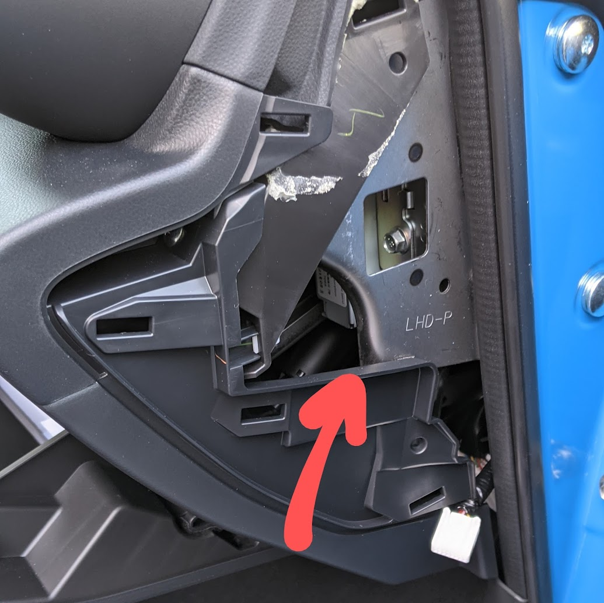
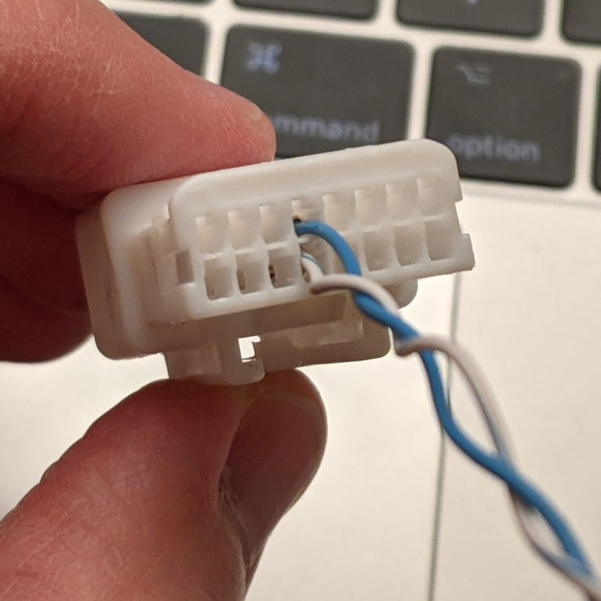

# CAN bus (2022 model year)

Special thanks to Ken Houseal for his early legwork on finding and documenting
how to connect to the CAN bus, and finding some of these data mappings!

## Connections

The ODB-II in the driver's footwell no longer exposes the CAN bus data except
for OBD-II requests. If you want to log data with high refresh rates, you need
to use an alternative connection.

A common place to get access to the CAN bus is the ASC (a.k.a. "fake engine
noise") female connector. It is located inside the dash slightly to the right of
the glovebox, and is accessible by pulling off the panel on the right side of
the dash.

You can then buy a male connector by TE Connectivity, part number 1376106-1.
You will also need to buy male pins, part number 1376109-1.

If you're ok with not having the ASC, you need to get at least one connector and
two pins. It might be useful to get some extra in case you fail to crimp the
pins, or something like that.

If you want to keep ASC working, you can also buy a female connector and female
pins, and make a "T" bridge. The part numbers and wiring schematics are out of
scope of this documentation.

Here's how you should wire the male connector:

  The blue wire on this photo is CAN H, the white wire is CAN L.

## Details on some CAN IDs

TODO

### Typical histogram of CAN IDs

Here's what the distribution of CAN IDs looks like in the CAN bus while idling in a
parking lot:

 CAN ID (hex) | CAN ID (decimal) | Number of packets received over a 10 second period
---- | --- | ---
0x40 | 64 | 1000
0x41 | 65 | 1000
0x118 | 280 | 500
0x138 | 312 | 500
0x139 | 313 | 500
0x13B | 315 | 500
0x13C | 316 | 500
0x143 | 323 | 500
0x146 | 326 | 500
0x228 | 552 | 167
0x241 | 577 | 200
0x2D2 | 722 | 334
0x328 | 808 | 100
0x32B | 811 | 100
0x330 | 816 | 83
0x332 | 818 | 83
0x33A | 826 | 83
0x33B | 827 | 83
0x345 | 837 | 100
0x390 | 912 | 100
0x393 | 915 | 100
0x39A | 922 | 50
0x3A7 | 935 | 100
0x3AC | 940 | 100
0x3D9 | 985 | 50
0x500 | 1280 | 20
0x506 | 1286 | 20
0x509 | 1289 | 20
0x50B | 1291 | 20
0x660 | 1632 | 20
0x6B1 | 1713 | 10
0x6E2 | 1762 | 10
